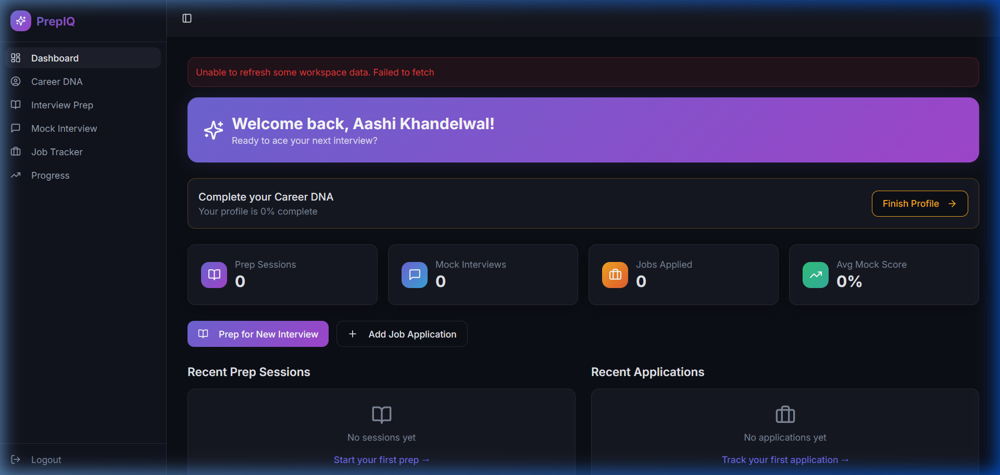
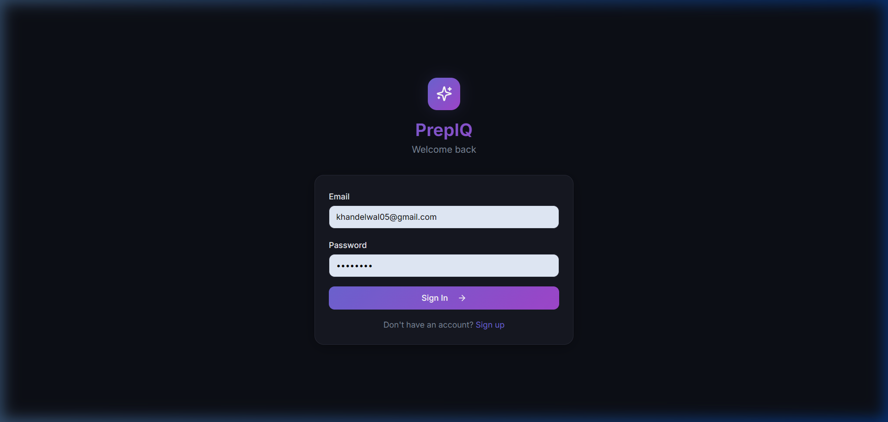

<p align="center">
  
</p>

<h1 align="center">PrepIQ</h1>

<p align="center">
  <strong>Your AI-powered interview preparation workspace</strong>
</p>

<p align="center">
  <a href="https://prepiqfrontend.vercel.app"></a>
  <a href="https://prepiq-backend-c79d.onrender.com/api/health"></a>
  <a href="./LICENSE"></a>
  
  
  
</p>

---

## 🌐 Live Links

| Service | URL |
|---------|-----|
| **Frontend** | [prepiqfrontend.vercel.app](https://prepiqfrontend.vercel.app) |
| **Backend API** | [prepiq-backend-c79d.onrender.com](https://prepiq-backend-c79d.onrender.com) |
| **API Docs** | [/docs](https://prepiq-backend-c79d.onrender.com/docs) |
| **Health Check** | [/api/health](https://prepiq-backend-c79d.onrender.com/api/health) |
| **Database** | Neon Postgres (managed) |

> **Note:** The backend runs on Render's free tier and may take ~30 seconds to wake up on first request after inactivity.

---

## 📖 About

PrepIQ is a full-stack interview preparation platform that combines career profiling, AI-assisted prep plans, mock interviews with scoring, job application tracking, and progress analytics — all in one workspace.

### Key Features

- **Account Management** — Signup, login, and persistent sessions with secure token auth
- **Career DNA Profiling** — Multi-step onboarding to capture skills, experience, and goals
- **AI Interview Prep** — Auto-generated gap analysis, question banks, and study roadmaps
- **Mock Interviews** — Practice with AI-scored answers, feedback, and model responses
- **Job Application Tracker** — Track applications with status, contacts, and next actions
- **Progress Dashboard** — Visual analytics for prep sessions, scores, and activity trends

---

## 🖼️ Preview

<p align="center">
  
</p>

<p align="center"><em>Dashboard — personalized welcome, stats overview, and quick actions</em></p>

<p align="center">
  
</p>

<p align="center"><em>Login — clean dark-themed authentication interface</em></p>

---

## ⚙️ Tech Stack

| Layer | Technologies |
|-------|-------------|
| **Frontend** | React 18, TypeScript, Vite, Tailwind CSS, shadcn/ui, Radix UI, Framer Motion, Recharts |
| **Backend** | FastAPI, SQLAlchemy, Pydantic, Uvicorn |
| **Database** | PostgreSQL (Neon) · SQLite for tests |
| **AI** | OpenRouter (free models with fallback) |
| **Auth** | HMAC-signed bearer tokens, PBKDF2 password hashing |
| **Deployment** | Vercel (frontend) · Render (backend) · Neon (database) |
| **Tooling** | ESLint, Vitest, Docker, GitHub Actions |

---

## 🚀 Getting Started

### Prerequisites

- [Node.js](https://nodejs.org/) 22+
- [Python](https://www.python.org/) 3.10+
- [PostgreSQL](https://www.postgresql.org/) 16+ (or use SQLite for local dev)

### Clone

```bash
git clone https://github.com/Aashikhandelwal05/-CareerCraft.git
cd CareerCraft
```

### Environment Setup

```bash
cp .env.example .env
```

Edit `.env` with your values. For local development with SQLite, set:

```env
DATABASE_URL=sqlite:///./backend/local.db
```

### Install Dependencies

```bash
# Frontend
npm install

# Backend
pip install -r backend/requirements.txt
```

### Run Locally

```bash
# Terminal 1 — Backend (port 8000)
python -m uvicorn backend.app.main:app --reload --host 127.0.0.1 --port 8000

# Terminal 2 — Frontend (port 8080)
npm run dev
```

Open [http://localhost:8080](http://localhost:8080) in your browser.

### Docker (optional)

```bash
docker compose up --build
```

This starts PostgreSQL, Backend, and Frontend together.

---

## 🔑 Environment Variables

| Variable | Description | Required |
|----------|-------------|----------|
| `DATABASE_URL` | SQLAlchemy connection string | ✅ |
| `APP_SECRET` | Signing secret for auth tokens | ✅ |
| `ACCESS_TOKEN_TTL_HOURS` | Token expiry in hours (default: `168`) | ❌ |
| `CORS_ORIGINS` | Comma-separated allowed frontend origins | ✅ |
| `OPENROUTER_API_KEY` | OpenRouter API key (empty = mock fallback) | ❌ |
| `OPENROUTER_MODEL` | AI model name (default: `openrouter/free`) | ❌ |
| `OPENROUTER_APP_NAME` | App label for OpenRouter dashboard | ❌ |
| `OPENROUTER_TIMEOUT_SECONDS` | AI request timeout (default: `30`) | ❌ |
| `VITE_API_BASE_URL` | Backend URL for deployed frontend | ❌ |

---

## 📡 API Endpoints

### Auth

| Method | Endpoint | Description |
|--------|----------|-------------|
| `POST` | `/api/auth/signup` | Create a new account |
| `POST` | `/api/auth/login` | Login with email & password |
| `GET` | `/api/auth/me` | Get current user from token |

### Profile

| Method | Endpoint | Description |
|--------|----------|-------------|
| `GET` | `/api/users/{id}/profile` | Get career DNA profile |
| `PUT` | `/api/users/{id}/profile` | Save/update profile |

### Interview Prep

| Method | Endpoint | Description |
|--------|----------|-------------|
| `GET` | `/api/users/{id}/sessions` | List all prep sessions |
| `GET` | `/api/users/{id}/sessions/{sid}` | Get session details |
| `POST` | `/api/users/{id}/sessions` | Create new AI prep session |

### Mock Interviews

| Method | Endpoint | Description |
|--------|----------|-------------|
| `GET` | `/api/users/{id}/mocks` | List all mock attempts |
| `POST` | `/api/users/{id}/mocks` | Submit answer for AI scoring |

### Job Tracker

| Method | Endpoint | Description |
|--------|----------|-------------|
| `GET` | `/api/users/{id}/jobs` | List all job applications |
| `POST` | `/api/users/{id}/jobs` | Add a new application |
| `PATCH` | `/api/users/{id}/jobs/{jid}` | Update application details |

### System

| Method | Endpoint | Description |
|--------|----------|-------------|
| `GET` | `/api/health` | Health check |

> Interactive API docs available at [`/docs`](https://prepiq-backend-c79d.onrender.com/docs)

---

## 📁 Project Structure

```
├── backend/
│   ├── app/
│   │   └── main.py              # FastAPI app — models, routes, AI logic
│   ├── tests/
│   │   └── test_api.py          # Backend smoke tests
│   └── requirements.txt         # Python dependencies
│
├── src/
│   ├── components/
│   │   ├── ui/                  # 49 shadcn/ui components
│   │   ├── AppLayout.tsx        # Main layout shell
│   │   ├── AppSidebar.tsx       # Navigation sidebar
│   │   └── ScoreCircle.tsx      # Animated score display
│   ├── pages/
│   │   ├── AuthPage.tsx         # Login / Signup
│   │   ├── DashboardPage.tsx    # Main dashboard with stats
│   │   ├── OnboardingPage.tsx   # Career DNA onboarding wizard
│   │   ├── InterviewPrepPage.tsx# AI prep session view
│   │   ├── MockInterviewPage.tsx# Mock interview interface
│   │   ├── JobTrackerPage.tsx   # Job application manager
│   │   ├── ProgressPage.tsx     # Analytics & progress charts
│   │   └── CareerDNAPage.tsx    # Profile editor
│   ├── lib/
│   │   ├── api.ts               # API client functions
│   │   ├── store.ts             # Global state management
│   │   └── utils.ts             # Utility helpers
│   └── hooks/                   # Custom React hooks
│
├── docs/                        # Screenshots & documentation
├── Dockerfile.backend           # Backend Docker image
├── Dockerfile.frontend          # Frontend Docker image
├── docker-compose.yml           # Full-stack local setup
├── vercel.json                  # Vercel SPA routing config
├── vite.config.ts               # Vite build configuration
└── package.json                 # Frontend dependencies & scripts
```

---

## 🚢 Deployment

This project deploys as three services — all on free tiers:

| Service | Platform | Purpose |
|---------|----------|---------|
| Frontend | [Vercel](https://vercel.com) | Static React build |
| Backend | [Render](https://render.com) | Dockerized FastAPI |
| Database | [Neon](https://neon.tech) | Managed PostgreSQL |

### Quick Deploy Steps

1. **Neon** — Create a free project, copy the connection string
2. **Render** — New Web Service → Docker → `Dockerfile.backend` → set env vars
3. **Vercel** — Import repo → Vite preset → set `VITE_API_BASE_URL`
4. **CORS** — Update `CORS_ORIGINS` on Render with your Vercel URL

---

## 🗺️ Roadmap

- [ ] Resume upload and PDF parsing
- [ ] Multiple AI model selection
- [ ] Interview session sharing and collaboration
- [ ] Email notifications for job application updates
- [ ] Mobile-responsive PWA support

---

## 📄 License

This project is licensed under the **MIT License** — see the [LICENSE](./LICENSE) file for details.

---

<p align="center">
  Built with ❤️ by <a href="https://github.com/Aashikhandelwal05">Aashi Khandelwal</a>
</p>
